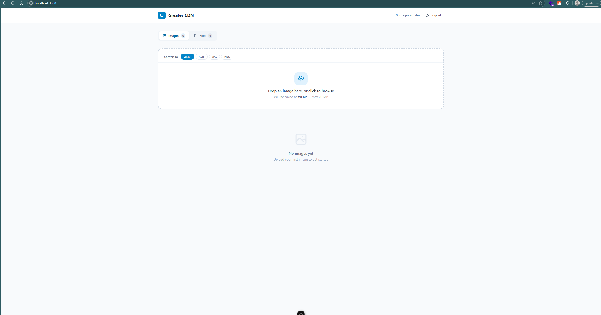

# Greates CDN

[](LICENSE)

A self-hosted CDN for images and files, built with Nuxt 4. Upload images with format conversion, or upload any file and get a public URL instantly. Protected by JWT authentication.



## Features

- **Image upload** — converts to WEBP, AVIF, JPG, or PNG using Sharp
- **File upload** — PDFs, videos, audio, documents, archives (up to 200 MB)
- **Download** — one-click download for both images and files
- **Public CDN URLs** — `https://yourdomain/images/slug.ext` and `https://yourdomain/files/slug.ext`
- **JWT authentication** — single-admin login, HttpOnly cookie session
- **Security hardened** — file type blocklist, brute force protection, HTTP security headers

## Requirements

- Node.js 18+
- npm

## Setup

### 1. Install dependencies

```bash
npm install
```

### 2. Configure environment variables

Copy and fill in your values:

```bash
cp .env.example .env
```

`.env` variables:

| Variable | Description | Example |
|---|---|---|
| `NUXT_CDN_USERNAME` | Admin login username | `admin` |
| `NUXT_CDN_PASSWORD` | Admin login password | `your_secure_password` |
| `NUXT_JWT_SECRET` | Secret key for JWT signing (min 32 chars) | `a_random_64_char_hex_string` |
| `NUXT_JWT_EXPIRY` | Session duration | `7d` |
| `NUXT_PUBLIC_BASE_URL` | Public base URL of the site | `https://cdn.yourdomain.com` |

## Development

```bash
npm run dev
```

Server starts at `http://localhost:3000`. Environment variables are automatically loaded from `.env`.

## Production

### Build

```bash
npm run build
```

### Run

Use the provided startup script, which loads `.env` before starting the server:

```bash
./start.sh
```

> **Note:** `node .output/server/index.mjs` directly does **not** auto-load `.env`. Always use `start.sh` in production.

## File Structure

```
server/
  middleware/auth.ts          # JWT validation on protected routes
  utils/auth.ts               # signToken / verifyToken (jose)
  utils/db.ts                 # JSON metadata store with write mutex
  utils/storage.ts            # Path helpers with traversal protection
  utils/rateLimit.ts          # In-memory login rate limiter
  api/auth/login.post.ts
  api/auth/logout.post.ts
  api/images/index.get.ts
  api/images/upload.post.ts   # Sharp conversion, 20 MB limit
  api/images/[id].delete.ts
  api/files/index.get.ts
  api/files/upload.post.ts    # Any file type (blocklist applied), 200 MB limit
  api/files/[id].delete.ts
app/
  middleware/auth.ts          # Client-side anti-flicker guard
  pages/login.vue
  pages/index.vue             # Dashboard (Images + Files tabs)
public/
  images/                     # Served at /images/...
  files/                      # Served at /files/...
data/
  images.json                 # Image metadata (gitignored)
  files.json                  # File metadata (gitignored)
```

## Security

| Measure | Detail |
|---|---|
| Authentication | JWT in `HttpOnly` cookie (`cdn_session`), `SameSite=strict` |
| CSRF | Blocked by `SameSite=strict` cookies |
| Brute force | 10 failed login attempts per IP locks out for 15 minutes |
| File upload | Blocklist of 30+ dangerous extensions (`.php`, `.sh`, `.exe`, `.html`, `.js`, etc.) |
| SVG | Blocked on image upload (can contain inline scripts) |
| Path traversal | `imagePath()`/`filePath()` verify resolved path stays within directory |
| HTTP headers | `X-Content-Type-Options`, `X-Frame-Options: DENY`, `Referrer-Policy`, `Permissions-Policy` |
| HSTS | Add `Strict-Transport-Security` header once TLS is confirmed on your domain |

## Kubernetes / Docker

- `sharp` is configured as an external dependency (`nitro.externals.external`) — do **not** bundle it
- Run `npm install --production` in your image to preserve Sharp's native binaries
- Mount a persistent volume to `/app/public/images`, `/app/public/files`, and `/app/data`
- Pass all `NUXT_*` env vars via Kubernetes `Secret` or `ConfigMap`

## License

MIT — see [LICENSE](LICENSE)
